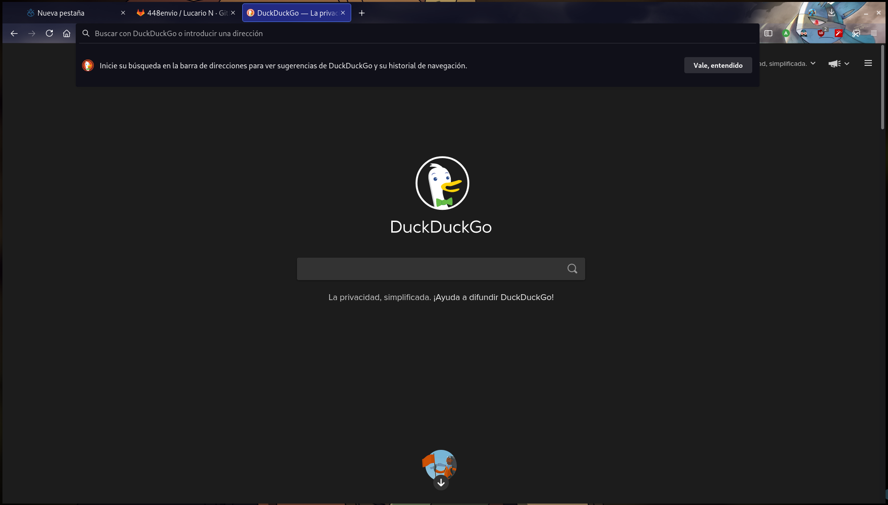

# Lucario N

Mi tema feito solo para Firefox

Disfruta de este Lucario

## ¿Como consigo este tema?

Puede hacerlo de 2 maneras:

La manera mas facil y la recomendada es mediante la pagina [**Firefox Add Ons**](https://addons.mozilla.org/en-US/firefox/addon/lucario-n/)

Si quiere, puede descargarlo desde [**aqui**](https://github.com/448L/Lucario-N/releases)

## Unas cositas mas que decir

No intente comprimir y empaquetar a XPI, simplemente fallara. una vez que se modifique el archivo como tal, la firma de Mozilla se invalidara, por eso le recomiendo que descarge el tema desde la pagina oficial [**Firefox Add Ons**](https://addons.mozilla.org/en-US/firefox/addon/lucario-n/) o la descarge desde una version [**Liberada**](https://github.com/448L/Lucario-N/releases). Tambien por esa razon, las versiones nuevas llegaran primero a la pagina oficial.

## Autor de la ilustracion

**mike_n0ra** - [Twitter](https://twitter.com/mike_n0ra) - [Pixiv](https://www.pixiv.net/en/users/34635088)

No estoy relacionado con el, solo use y modifique su ilustracion.
